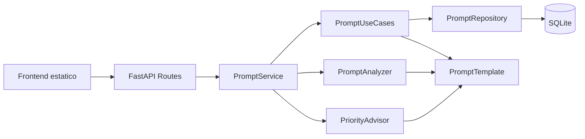

# Arquitetura

## Visão geral

O projeto adota Clean Architecture para separar responsabilidades e manter a aplicação simples de entender, testar e evoluir.

## Justificativa para uso de Clean Architecture

Clean Architecture ajuda a isolar regras de negócio de detalhes de framework, banco e interface. Para este MVP, isso facilita a apresentação acadêmica e mostra uma organização coerente entre domínio, aplicação, infraestrutura e entrega.

## Responsabilidade de cada camada

### `domain`

Define a entidade pura `PromptTemplate` e o enum `PromptStatus`, concentrando o núcleo do modelo sem dependência de ORM.

### `application`

Agrupa contratos, DTOs, schemas de entrada, casos de uso e serviços responsáveis por validação, orquestração, análise local e cálculo de prioridade.

### `infrastructure`

Concentra a configuração do banco SQLite, o modelo ORM `PromptModel` e o repositório concreto de persistência.

### `api`

Expõe a aplicação via FastAPI, com rotas HTTP, status codes e integração com Swagger.

### `frontend`

Interface web estática para consumir a API e demonstrar os fluxos do sistema.

## Diagrama Mermaid de componentes

O diagrama principal da implementacao foi separado em `docs\arquitetura\diagramas\arquitetura-sistema.md`.

## Fluxo de criação de prompt

1. O frontend envia um `POST /api/prompts`.
2. A rota valida o payload com `PromptCreateRequest`.
3. `PromptService` delega a criação para `PromptUseCases`.
4. `PromptUseCases` instancia a entidade de domínio `PromptTemplate`.
5. `PromptRepository` converte a entidade para `PromptModel` e persiste o registro no SQLite.
6. A API retorna `PromptResponse`.

## Fluxo de análise de prompt

1. O cliente chama `POST /api/prompts/{prompt_id}/analyze`.
2. O serviço busca o prompt pelo ID.
3. `PromptAnalyzer` avalia critérios locais de qualidade.
4. A API retorna score, classificação e sugestões.

## Fluxo de cálculo de prioridade

1. O cliente chama `POST /api/prompts/{prompt_id}/priority`.
2. O serviço recupera o prompt e executa a análise local.
3. `PriorityAdvisor` calcula a prioridade com base em score, status e lacunas.
4. A API retorna prioridade, justificativa e ação recomendada.

## Limitações da arquitetura no MVP

- A persistência continua simplificada com SQLModel, mas a entidade de domínio foi separada para reduzir acoplamento.
- O frontend estático consome a API diretamente, sem camada de BFF.
- A composição de dependências ainda é simples e manual, apesar de centralizada em `api/dependencies.py`.

## Possíveis evoluções

- Evoluir as portas atuais para um conjunto mais amplo de adaptadores explícitos.
- Migrar a persistência para PostgreSQL.
- Adicionar autenticação e observabilidade.
- Criar histórico versionado de prompts e dashboards analíticos.
