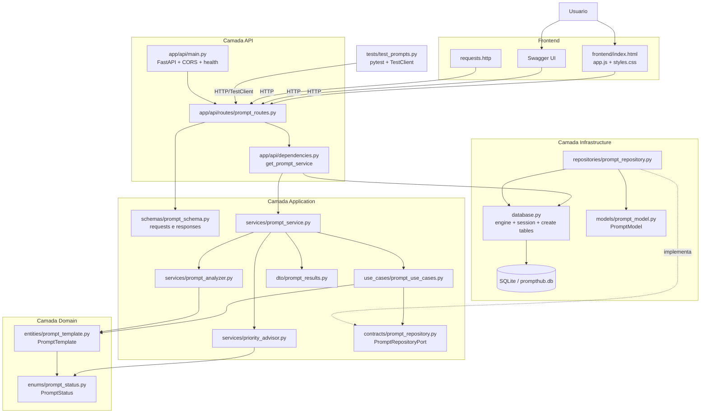

# Diagrama de Arquitetura do Sistema

Diagrama regenerado a partir da implementacao atual do PromptHub AI Python, refletindo a separacao entre `domain`, `application`, `infrastructure`, `api` e `frontend`.

## Leitura do diagrama

- A camada `api` recebe chamadas do frontend, Swagger, `requests.http` e testes.
- `api/dependencies.py` centraliza a composicao do `PromptService`.
- `PromptService` orquestra os casos de uso e os servicos de analise e prioridade.
- `PromptUseCases` depende da porta `PromptRepositoryPort`, nao da implementacao concreta.
- `PromptRepository` implementa a porta e converte entre `PromptTemplate` e `PromptModel`.
- A entidade `PromptTemplate` permanece no dominio, sem dependencia de ORM.
- A persistencia continua simples com SQLite e SQLModel na infraestrutura.
